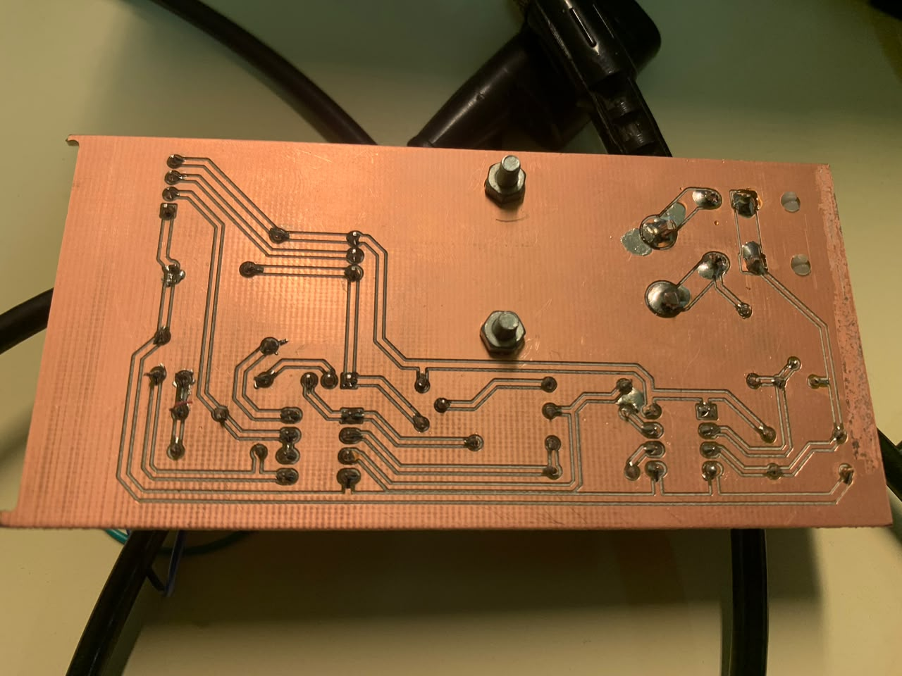
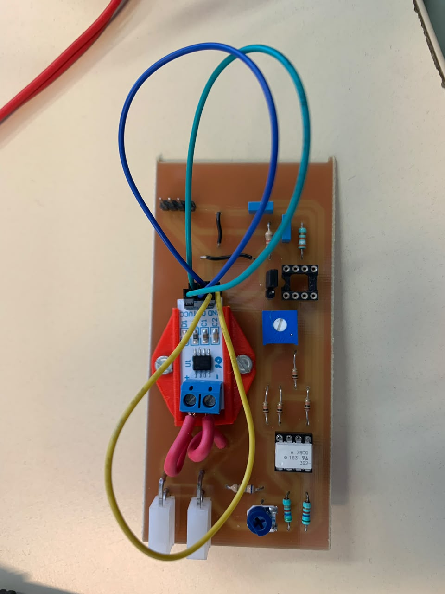
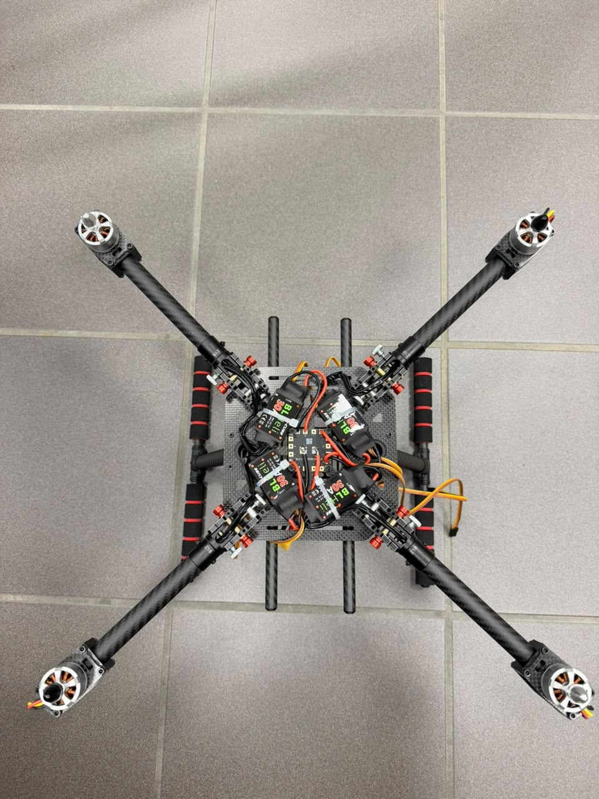
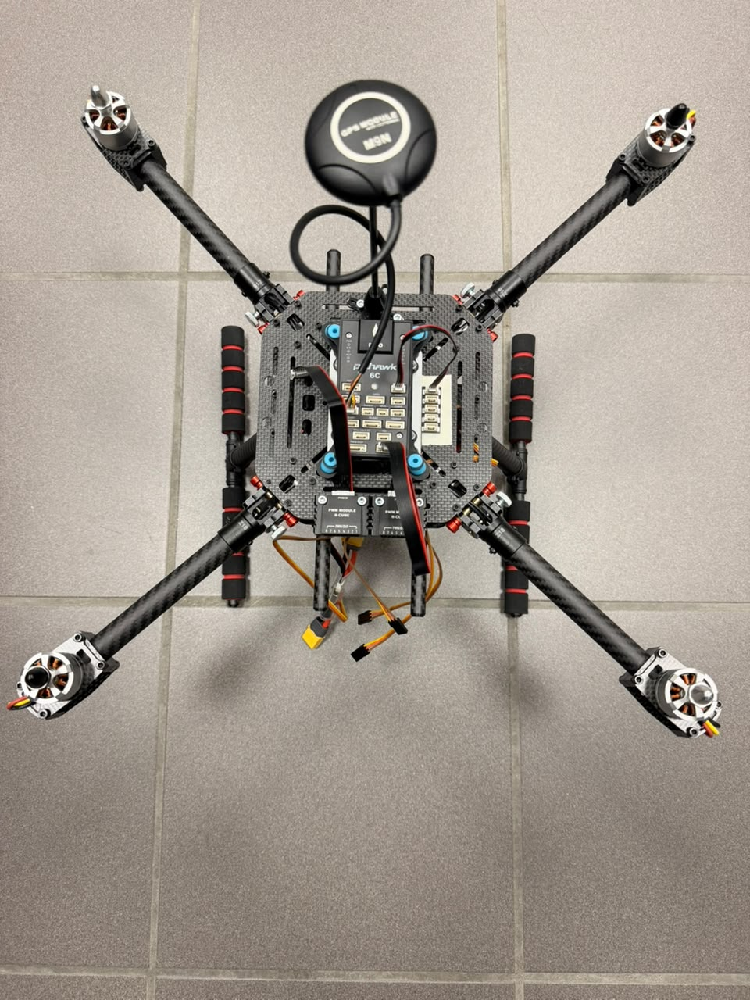
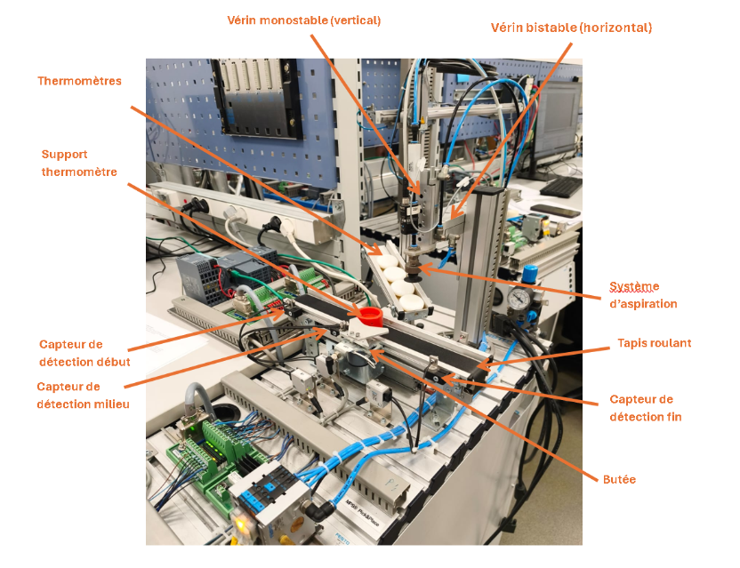

# Portfolio de projets d'ingénierie — Daouda SYLLA

Élève-ingénieur en 3e année à l'**ENSISA** (Mulhouse), spécialité **Automatique et Systèmes Embarqués**.
Ce dépôt présente, de façon détaillée, plusieurs de mes projets en électronique, automatisation et systèmes embarqués.

**Contact :** daoudesylla@gmail.com · [LinkedIn](https://linkedin.com/in/sylla-daouda) · [GitHub](https://github.com/EngS1)

## Sommaire

| # | Projet | Domaine | Outils |
|---|--------|---------|--------|
| 1 | [Wattmètre numérique](#1-wattmètre-numérique) | Électronique, acquisition, traitement du signal | LTspice, KiCad, C/C++ |
| 2 | [Drone quadricoptère ArduPilot / ROS 2](#2-drone-quadricoptère-ardupilot--ros-2) | Robotique aérienne, systèmes embarqués | Pixhawk, ArduPilot, ROS 2 |
| 3 | [Automatisation d'un poste de placement](#3-automatisation-dun-poste-de-placement) | Automatisation industrielle | Siemens TIA Portal, GRAFCET, IHM |
| 4 | [Autres réalisations](#4-autres-réalisations) | Contrôle-commande, systèmes embarqués | Matlab/Simulink, FreeRTOS, Vector CANoe |

---

## 1. Wattmètre numérique

**Projet de 1re année · Conception d'un instrument de mesure, du cahier des charges à la visualisation des mesures**

| | |
|---|---|
|  |  |  |

### Objectif
Réaliser un wattmètre numérique complet en suivant toutes les étapes d'un projet d'ingénierie, de l'analyse du besoin jusqu'à l'exploitation des mesures.

### Démarche
1. **Analyse du cahier des charges** : identification des exigences et des contraintes de l'instrument.
2. **Architecture technique** : découpage de la chaîne de mesure en blocs fonctionnels.
3. **Simulation sous LTspice** : validation du fonctionnement des circuits avant fabrication.
4. **Schématique sous KiCad** : reprise et finalisation de la conception électronique.
5. **Conception du PCB sous KiCad** : placement, routage et préparation de la carte.
6. **Réalisation et soudure** de la carte.
7. **Acquisition des données** par le système embarqué.
8. **Traitement du signal numérique** (C/C++) : calcul des grandeurs à partir des échantillons acquis.
9. **Visualisation** des mesures et des résultats après calcul.

### Compétences mobilisées
Conception de chaîne d'acquisition · simulation de circuits · conception de PCB · soudure · programmation C/C++ embarquée · traitement numérique du signal · intégration matériel/logiciel.

---

## 2. Drone quadricoptère ArduPilot / ROS 2

**Projet personnel · Monter une plateforme de drone pour progresser en ROS 2 et sur les engins volants**

| | |
|---|---|
|  |  |

### Objectif
Acquérir des compétences sur les engins volants et approfondir ROS 2 sur une plateforme réelle, que je monte et configure moi-même.

### Matériel
- Kit quadricoptère **B-CUBE** : contrôleur de vol **Pixhawk 2.4.8** (firmware **ArduPilot**), cadre carbone **450**
- Moteurs **2212** et contrôleurs de vitesse (ESC) **BLHeli 30 A**
- Télémétrie radio **100 mW**

### Avancement et architecture visée
- **Montage matériel** : en cours de finalisation.
- **Ordinateur de bord (companion computer)** : ajout prévu à la plateforme pour développer sous ROS 2 et embarquer de l'intelligence artificielle.

### Compétences visées
Intégration matériel d'un drone · ArduPilot · ROS 2 · IA embarquée · systèmes autonomes.

---

## 3. Automatisation d'un poste de placement

**TP d'automates programmables (2A ASE) · Siemens TIA Portal, GRAFCET, IHM · réalisé en binôme avec Muhammed CEREN**

| | |
|---|---|
|  | ![Interface de supervision (IHM)]Poste-placement-02-ihm.png) |
| *Vue d'ensemble du poste de placement* | *Interface de supervision (IHM)* |

### Contexte
Automatisation du **poste 4 (Placement)** d'une ligne d'assemblage de thermomètres : le poste insère un thermomètre sur un support plastique. Le système comprend un **convoyeur** pour le flux des pièces et un **manipulateur pneumatique 2 axes** pour la prise et la dépose.

### Architecture de programmation
Le programme, développé sous **TIA Portal**, est découpé en **6 GRAFCET** indépendants pour obtenir une gestion modulaire et sécurisée :

| GRAFCET | Rôle |
|---------|------|
| **Sélection de marche** | Orchestre les modes Auto, Semi-Auto, Manuel et Réarmement |
| **Auto — Tâche 1** | Manipulateur (prise, transfert, dépose, retour) |
| **Auto — Tâche 2** | Tapis (arrivée des pièces, butée, évacuation, comptage du lot) |
| **Semi-Auto — Tâche 1** | Manipulateur, une seule séquence par ordre de départ cycle |
| **Semi-Auto — Tâche 2** | Tapis, traitement d'une pièce unique |
| **Manuel** | Pilotage individuel de chaque actionneur, avec interdictions de sécurité |

### Gestion des modes
- **Auto / Semi-Auto** : activables uniquement depuis les **conditions initiales** (vérins rentrés et en haut).
- **Manuel** : accessible à tout moment ; il désactive les autres modes pour éviter les conflits d'actionneurs.
- **Arrêt d'urgence et réarmement** : un appui sur l'arrêt d'urgence bloque le système ; le bouton de réarmement le ramène à l'état initial.

### Mode automatique (production normale)
- **Manipulateur (tâche 1)** : prise (descente et aspiration), attente du signal `Synchro_tache_tapis`, transfert horizontal avec maintien de l'aspiration, dépose (descente et coupure de l'aspiration), retour en position initiale.
- Le **vérin de descente est monostable** : son action est maintenue dans les étapes concernées pour qu'il reste en bas.
- **Tapis (tâche 2)** : le tapis avance jusqu'à la détection d'une pièce contre la butée (`Presence_piece_milieu`) et autorise alors la dépose. Une fois la pose terminée, la butée s'escamote et le tapis évacue la pièce.
- **Comptage** : un compteur décrémente le lot (4 pièces) ; à 0, le cycle s'arrête. Les pièces d'approvisionnement sont comptées depuis l'IHM, le poste n'ayant pas de capteur de présence pour le thermomètre.
- Les deux tâches sont **synchronisées** par échange de signaux entre GRAFCET.

### Mode semi-automatique (cycle par cycle)
Destiné au réglage et à la validation unitaire : le système s'arrête après chaque pièce et attend une nouvelle impulsion **Départ Cycle** depuis l'IHM. La cinématique est identique au mode automatique, mais les GRAFCET sont indépendants et sans notion de lot.

### Mode manuel et sécurités
Chaque actionneur est piloté depuis l'IHM. Des équations logiques interdisent les actions dangereuses : par exemple, la sortie du vérin horizontal n'est possible que si le capteur `fdc_verin_haut` est actif, ce qui protège la butée et le manipulateur.

### Supervision (IHM)
L'IHM permet de **sélectionner le mode** (ce qui active le GRAFCET correspondant) et de **visualiser l'état des étapes en temps réel**. Ce TP a été ma première programmation d'IHM.

### Compétences mobilisées
Programmation d'automate sous TIA Portal · modélisation en GRAFCET · logique Ladder · conception d'IHM · gestion des modes de marche · sécurité des opérateurs et du matériel · synchronisation de tâches.

---

## 4. Autres réalisations

| Projet | Description | Outils |
|--------|-------------|--------|
| **[IA embarquée pour le pilotage du robot ROMI](https://github.com/EngS1/romi-gesture-control-uno-q)** | Pilotage d'un robot mobile par reconnaissance gestuelle, modèle d'IA exécuté sur Arduino UNO Q et commande par Bluetooth | Python, C++, Zephyr RTOS |
| **[MeetingPro](https://github.com/EngS1/Projet_CEREN_SYLLA)** | Application de réservation de salles avec interface graphique | Python, tkinter |
| **Pilotage distribué sur bus CAN — robot ROMI** | Modélisation et supervision d'un réseau multiplexé : analyse de messagerie, création de bases de données CAN, tableau de bord virtuel (signalisation, télémétrie batterie, groupe motopropulseur) | Vector CANoe, CAN, C++ |
| **Régulation de température temps réel** | Architecture multitâche avec gestion des priorités, préemption et synchronisation inter-tâches | C/C++, FreeRTOS |
| **Identification et commande d'un système Twin Rotor** | Identification expérimentale, modélisation dynamique, analyse des couplages et perturbations, synthèse d'une commande robuste | Matlab/Simulink |
| **Travaux de contrôle-commande** | Synthèse de correcteurs, retour d'état, identification de systèmes | Matlab/Simulink, SISOTOOL |
| **Projets de systèmes embarqués** | Programmation de microcontrôleurs, communication série et temps réel | C/C++ |
